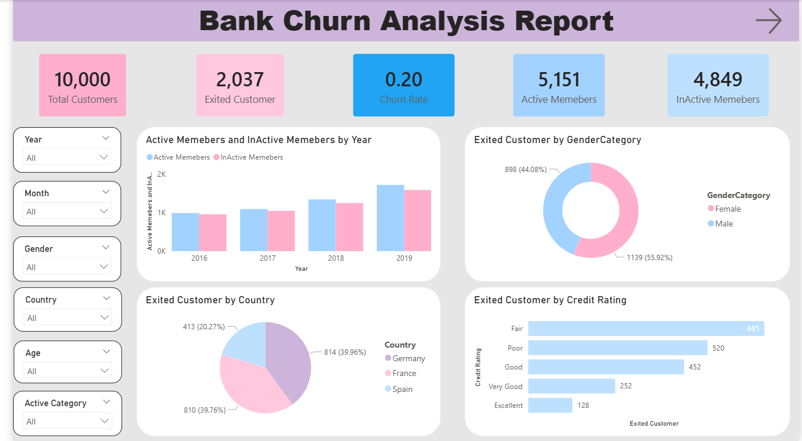
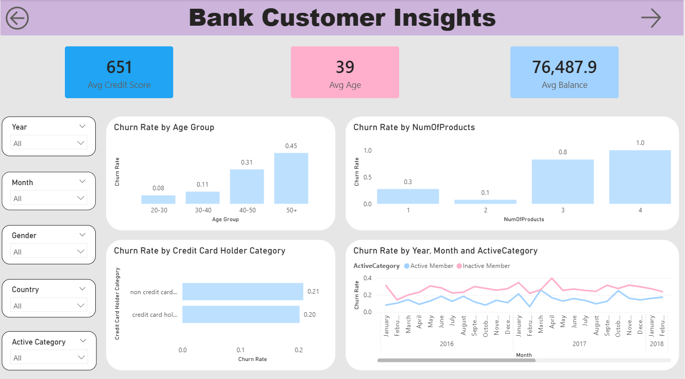
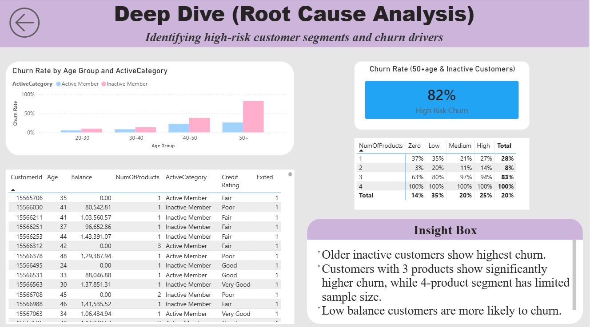

# 📊 Bank Churn Analysis (Power BI)

## 📌 Project Overview
This project analyzes customer churn behavior in a bank using Power BI. The goal is to identify key drivers of churn and provide actionable insights to improve customer retention.

---

## 🎯 Objectives
- Identify high-risk customer segments  
- Analyze churn across demographics and behavioral factors  
- Understand root causes of customer churn  
- Enable data-driven decision making for retention strategies  

---

## 📊 Dataset
The dataset contains customer-level information including:
- Demographics (Age, Gender, Geography)  
- Financial data (Balance, Credit Score, Estimated Salary)  
- Account details (Number of Products, Credit Card, Active Status)  
- Churn indicator (Exited)
  
---

## 🔗 Data Modeling
- Implemented a multi-table data model:
  - **Bank_Churn** (fact table)
  - **CustomerInfo, CreditCard, Geography** (dimension tables)
- Created relationships to enable cross-filtering across visuals  
- Used calculated columns for segmentation (Age Group, Balance Group)  

---

## 📁 Dashboard Structure

### 🔹 Executive Summary
- Total customers, churn rate, active vs inactive members  
- Churn distribution by gender, country, and credit rating  

### 🔹 Customer Insights
- Churn by age group  
- Churn by number of products  
- Churn by credit card ownership  
- Monthly churn trends (Active vs Inactive customers)  

### 🔹 Deep Dive (Root Cause Analysis)
- High-risk segment analysis (older inactive customers)  
- Product usage vs churn behavior  
- Balance-based churn segmentation  
- Detailed churned customer-level table  

---

## ✨ Dashboard Features
- Interactive slicers (Year, Month, Gender, Country, Age Group)  
- Drill-down analysis across multiple pages  
- Custom tooltips for Balance vs Churn insights  
- Dynamic filtering across visuals  
- Multi-page navigation (Overview → Insights → Deep Dive)  

---

## 📊 Key DAX Measures
- **Churn Rate** = Exited Customers / Total Customers  
- Customer Segmentation using:
  - Age Group  
  - Balance Group (Low, Medium, High)  
- High Risk Churn (50+ age & inactive customers)  

---

## 📈 Key Insights
- Older (50+) inactive customers show the highest churn  
- Customers with 3 products have significantly higher churn  
- Low balance customers are more likely to churn  
- Non-credit card holders show slightly higher churn  
- Customer inactivity is a major driver of churn  

---

## 📈 Business Impact
- Identifies high-risk churn segments  
- Helps improve customer retention strategies  
- Enables data-driven decision making for business teams  

---

## 💡 Recommendations
- Target older inactive customers with personalized retention campaigns  
- Improve engagement for customers with multiple products  
- Offer incentives or benefits for low-balance customers  
- Promote credit card usage to reduce churn risk  

---

## 📸 Dashboard Preview

### 🔹 Executive Summary

### 🔹 Customer Segmentation

### 🔹 Churn Driver Analysis

---

## 🛠 Tools & Technologies Used
- Power BI  
- DAX (Data Analysis Expressions)  
- Power Query (Data Cleaning & Transformation)  
- Data Modeling  

---

## ▶ How to Use
1. Download the `.pbix` file from the **Dashboard** folder  
2. Open in Power BI Desktop  
3. Use slicers and filters to explore customer segments 
